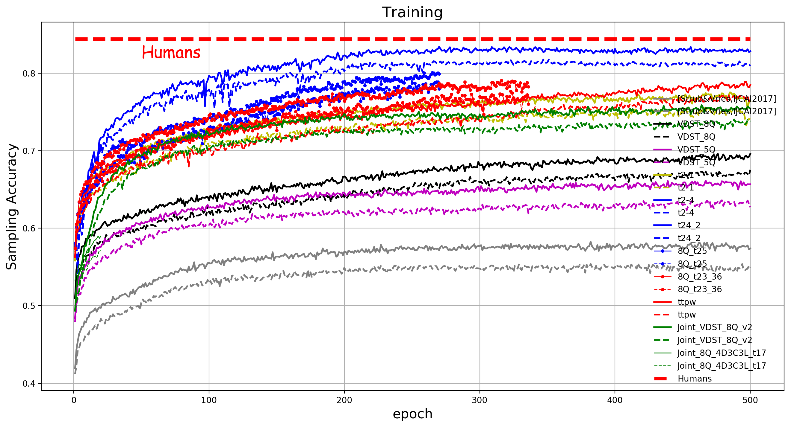

# About Me
虚步, a Ph.D. student at BUPT. I am very fortunate to be advised by my advisor. My research is in the area of Vision, Language and Reasoning, with a focus on Visual Dialogue. In particular, I am interested in building a visually-grounded conversational AI (social robot) that can see the world and talk with us in natural language. Other interests include Visual/Language Grounding, Visual Reasoning, Visual Question Generation and Visually-grounded Referring Expression.

<b>Now I'm doing research on GuessWhich and Visual Dialog(VisDial)</b>, please feel free to concat me with pangweitf@bupt.edu.cn or pangweitf@163.com if you have any questions or concerns.

# GuessWhat?! Game

GuessWhat?! is an image object-guessing game between two players. It has attracted great research interest in recent years.

Tensorflow implementation of the paper: 
Visual Dialogue State Tracking for Question Generation 
Wei Pang, Xiaojie Wang 
https://arxiv.org/abs/1911.07928 
AAAI 2020 (Oral) 

# Latest Progress on GuessWhat?! Game

(https://github.com/xubuvd/guesswhat/raw/master/GuessWhat_accuracy_Nov2019.png)

arXiv: https://arxiv.org/abs/2002.10340

As shown in the uploaded figure "guesswhat_performance_2019.png", our latest research progress of GuessWhat?! game, it achieves near-perfect accuracy of 83.3% and outperforms all the previous methods. Notes that the human-level performance is 84.4%.

<b>This research was started in Mar. 2019 and ended in Nov. 2019.</b>

The experimental codes are stilling being refined, coming soon.

# Reference
@InProceedings{pang2020guesswhat, 
  title={Visual Dialogue State Tracking for Question Generation}, 
  author={Wei Pang and Xiaojie Wang}, 
  booktitle={Proceedings of the Thirty-Fourth AAAI Conference on Artificial Intelligence (AAAI)}, 
  year={2020} 
} 
@article{pw2020Guesser, 
  title={Guessing State Tracking for Visual Dialogue}, 
  author={Wei Pang and Xiaojie Wang}, 
  booktitle={arXiv:2002.10340}, 
  year={2020} 
} 

	

# Current Vision-and-Language-and-Reasoning tasks, focuses on Visual Dialogue
1. Multimodal Dialogs(MMD), AAAI 2018 
2. CoDraw, ACL 2019 
3. GuessWhich, AAAI 2017 
4. Multi-agent GuessWhich, AAMAS 2019 
5. GuessWhat?!, CVPR 2017 
6. EmbodiedQA, CVPR 2018 
7. VideoNavQA, BMVC 2019 
8. GuessNumber, SLT 2018 
9. VisDial, CVPR 2017 
10. Image-Grounded Conversations(IGC), CVPR 2017 
11. VDQG, ICCV 2017 
12. RDG-Image guessing game, LREC 2014 
13. Deal or No Deal, CoRR 2017 
14. Video-Grounded Dialogue Systems (VGDS), ACL 2019 
15. Vision-Language Navigation (VLN), CVPR 2018 
16. Image Captioning 
17. Image Retrieval 
18. Visually-grounded Referring Expressions 
19. Multi-modal Verification, ACL 2019 
20. Viual Dialog based Referring Expression 
21. VQA 

