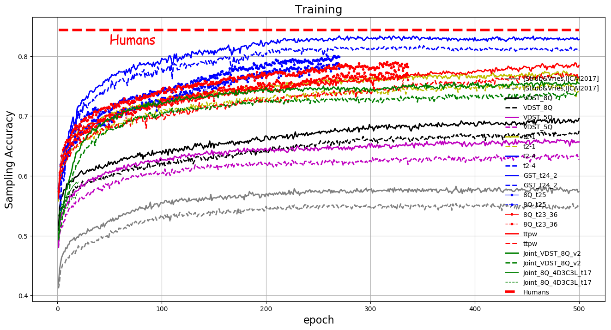

# About Me
虚步, a Ph.D. student at BUPT. I am very fortunate to be advised by my advisor. My research is in the area of Vision, Language, and Reasoning, with a focus on Visual Dialogue. I am particularly interested in building a visually-grounded conversational AI (social robot) that can see the world and talk with us in natural language. Other interests include Visual/Language Grounding, Visual Reasoning, Visual Question Generation, and Visually-grounded Referring Expression.

Now I've been working on the GuessWhich task and Visual Dialog(VisDial) task, please feel free to contact me with pangweitf@bupt.edu.cn or pangweitf@163.com if you have any questions or concerns.

# GuessWhat?! Game

GuessWhat?! is an image object-guessing game between two players. Recently it has attracted considerable research interest in computer vision and natural language processing community.

# Reference

If you find this work is useful in your research, please kindly consider citing:

@InProceedings{pang_2020_AAAI, 
  title={Visual Dialogue State Tracking for Question Generation}, 
  author={Wei Pang and Xiaojie Wang}, 
  booktitle={AAAI}, 
  year={2020} 
} 
@InProceedings{pang_2020_ECCV, 
  title={Guessing State Tracking for Visual Dialogue}, 
  author={Wei Pang and Xiaojie Wang}, 
  booktitle={ECCV}, 
  year={2020} 
} 

Tensorflow implementation of the 3 papers: 

## 1. Visual Dialogue State Tracking for Question Generation 
Wei Pang, Xiaojie Wang 
Center for Intelligence Science and Technology (CIST), Beijing University of Posts and Telecommunications 
https://arxiv.org/abs/1911.07928 
https://www.aaai.org/Papers/AAAI/2020GB/AAAI-PangW.4189.pdf 
<b>In AAAI 2020 (Oral)</b> 

## 2. Guessing State Tracking for Visual Dialogue 
Wei Pang, Xiaojie Wang 
Center for Intelligence Science and Technology (CIST), Beijing University of Posts and Telecommunications 
https://arxiv.org/abs/2002.10340 
<b>In ECCV 2020</b> 

## 3. experiment is in progress... 

GuessWhich has two conversational players: Q-Bot and A-Bot. In contrast, GuessWhat?! has three agents - QGen, Guesser and Oracle. This is a problem. 

07/2020 ~ ... 

# Latest Progress on the GuessWhat?! Game
## Sampling accuracy on training set and validation set during Reinforencement Learning

## Comparision with all the GuessWhat?! models that is known to date
 Guesser | QGen  | Max Q's | NewObject_S | G | BS | NewGame_S | G | BS
 --------| :-----------:  | :-----------:|:-----------:|:-----------:|:-----------:|:-----------:|:-----------:|:-----------:
 guesser[20] | qgen[20] | 5  |41.6| 43.5| 47.1| 39.2| 40.8 |44.6
 guesser(MN)[27]|TPG[27]|8   |- |48.77| -| -| -| -
 guesser[19] | qgen[19] |8 |- |44.6| -| -| -| -
 GST(ours) | qgen[19] |8|41.73| 44.89| - |39.97| 41.36| -
 guesser[19]|VDST[13]|5|45.02|49.49| - |42.92 |45.94 |-
 guesser[19]|VDST[13]|8|46.70 |48.01| - |44.24 |45.03| -
 GST(ours)|VDST[13]|5| 49.55| 53.35| 53.17| 46.95 |50.58 |50.71
 GST(ours)|VDST[13]|8 |52.71 |54.10| 54.32 |50.19 |50.97 |50.99
 GDSE-SL[17] |GDSE-SL[17]|5 |- |- |-| - |47.8| -
 GDSE-SL[17] |GDSE-SL[17]|8| -| -| -| -| 49.7| -
 GDSE-CL[17] |GDSE-CL[17]|5|-| -| -| - |53.7| -
 GDSE-CL[17] |GDSE-CL[17]|8|-| -| - |- |58.4| -
 guesser[10]|randQ[10]|5 |- |- |-| - |42.48| -
 guesser[10]|countQ[10]|5| - |- |-| - |61.64| -
 guesser(MN)[27]|TPG[27]|5|62.6| -| -| - |- |-
 guesser(MN)[27]|TPG[27]|8|-| -| -| -| 74.3| -
 guesser(MN)[27]|ISM[1]| -| 74.4| - |-| 72.1| -| -
 guesser(MN)[27]|TPG[27] |8| -| 74.3| - |- |- |-
 guesser(MN)[27]|ISD[2] |5| 68.3| 69.2 |- |66.3| 67.1| -
 guesser[19]|VQG[26] |5 |63.2| 63.6 |63.9| 59.8 |60.7| 60.8
 guesser[19]|ISM[1] |- |- |64.2| - |- |62.1| -
 guesser[19]|ISD[2] |5| 61.4| 62.1 |63.6 |59.0| 59.8| 60.6
 guesser[19]|RIG(rewards)[18] |8 |65.20 |63.00| 63.08| 64.06| 59.0 |60.21
 guesser[19]|RIG(loss)[18] |8 |67.19 |63.19 |62.57| 65.79 |61.18| 59.79
 guesser[19]|qgen[19]|5 |58.5 |60.3 |60.2 |56.5 |58.4 |58.4
 guesser[19]|qgen[19]|8 |62.8 |58.2 |53.9 |60.8 |56.3 |52.0
 guesser(MN)[27]|qgen[19]|5 |59.41 |60.78 |60.28 |56.49 |58.84| 58.10
 guesser(MN)[27]|qgen[19]|8 |62.05 |62.73 |- |59.04 |59.50| -
 GST(ours)|qgen[19]|5 |64.78 |67.06 |67.01 |61.77| 64.13 |64.26
 guesser[19]|VDST[13]|5 |66.22 |67.07 |67.81 |63.85 |64.36 |64.44
 guesser[19]|VDST[13]|8 |69.51 |70.55 |71.03 |66.76 |67.73 |67.52
 GST(ours)|VDST[13] (ours)|5 |<b>77.38</b>| <b>77.30</b> |<b>77.23</b> |<b>75.11</b> |<b>75.20</b> |<b>75.13</b>
 GST(ours)|VDST[13] (ours)|8 |<b>83.22</b>| <b>83.32</b> |<b>83.46</b> |<b>81.50</b> |<b>81.55</b> |<b>81.62</b>
 Human[19]| - |-| - |84.4| -| - |84.4 |-

arXiv: https://arxiv.org/abs/2002.10340

As shown in the uploaded figure "guesser_201911_10.png", our latest progress on GuessWhat?! game, it achieves near-perfect accuracy of 83.3% and outperforms all the previous methods. Notes that the human-level performance is 84.4%.

<b>This research was started in Mar. 2019 and ended in Nov. 2019.</b>

<b>If you use the experimental codes, please contact me with pangweitf@bupt.edu.cn or pangweitf@163.com.</b>

# Current Vision-and-Language-and-Reasoning tasks, focuses on Visual Dialogue
 LaVi Tasks | conference  | comment
 ----------| :-----------:  | :-----------:
 GuessWhich|AAAI 2017|:camel:
 Multimodal Dialogs(MMD)|AAAI 2018|-
 CoDraw|ACL 2019|-
 GuessWhat?!|CVPR 2017|:smile:
 Multi-agent GuessWhich|AAMAS 2019|-
 Image-Chat|ACL 2020|
 EmbodiedQA|CVPR 2018|
 VideoNavQA|BMVC 2019|
 GuessNumber|SLT 2018|
 VisDial|CVPR 2017|:camel:
 Image-Grounded Conversations(IGC)|CVPR 2017|
 VDQG|ICCV 2017|
 RDG-Image guessing game|LREC 2014|
 Deal or No Deal|CoRR 2017|
 Video-Grounded Dialogue Systems (VGDS)|ACL 2019|
 Vision-Language Navigation (VLN)|CVPR 2018|
 Image Captioning||
 Image Retrieval||
 Visually-grounded Referring Expressions|
 Multi-modal Verification|ACL 2019|
 Viual Dialog based Referring Expression||
 VQA||
# Downloading pretrained model

We test the pretrained model on train, val and test set similar to previous work, each many times, the accuracy of the pretrained model as follows: 
 
732,154 and 372 are the number of batch of size 64 in train, val and test set respectively. 

1: 
>>>  New Objects  <<<  
100%|██████████| 732/732 [05:44<00:00,  2.86it/s] 
Accuracy (train - greedy): 0.8382912339188785 
ErroRate (train - greedy): 0.1617087660811215 
100%|██████████| 732/732 [05:12<00:00,  3.28it/s] 
Accuracy (train - sampling): 0.8304910886011027 
ErroRate (train - sampling): 0.16950891139889734 
>>> valid set <<<  
100%|██████████| 154/154 [01:08<00:00,  3.15it/s] 
Accuracy (valid - greedy): 0.8300487606663958 
ErroRate (valid - greedy): 0.16995123933360423 
100%|██████████| 154/154 [01:14<00:00,  3.24it/s] 
Accuracy (valid - sampling): 0.8212108898821617 
ErroRate (valid - sampling): 0.17878911011783827 
>>>  New Games  <<<  
100%|██████████| 372/372 [02:54<00:00,  3.10it/s] 
Accuracy (test - greedy): 0.815471936094177 
ErroRate (test - greedy): 0.184528063905823 
100%|██████████| 372/372 [02:50<00:00,  3.31it/s] 
Accuracy (test - sampling): 0.8124027748581039 
ErroRate (test - sampling): 0.18759722514189614 
>>>------------------------------------------------<<<  
 

2: 
>>>  New Objects  <<<  
100%|██████████| 732/732 [05:41<00:00,  4.02it/s] 
Accuracy (train - greedy): 0.8367312048553234 
ErroRate (train - greedy): 0.16326879514467663 
>>> valid set <<<  
100%|██████████| 154/154 [01:06<00:00,  3.75it/s] 
Accuracy (valid - greedy): 0.8267980495733441 
ErroRate (valid - greedy): 0.17320195042665587 
>>>  New Games  <<<  
100%|██████████| 372/372 [02:37<00:00,  3.71it/s] 
Accuracy (test - greedy): 0.815471936094177 
ErroRate (test - greedy): 0.184528063905823 
>>>------------------------------------------------<<<  
 

3: 
>>>  New Objects  <<<  
100%|██████████| 732/732 [05:09<00:00,  3.46it/s] 
Accuracy (train - greedy): 0.83559858101466 
ErroRate (train - greedy): 0.16440141898534 
>>> valid set <<<  
100%|██████████| 154/154 [00:58<00:00,  3.33it/s] 
Accuracy (valid - greedy): 0.8278138967899228 
ErroRate (valid - greedy): 0.1721861032100772 
>>>  New Games  <<<  
100%|██████████| 372/372 [02:45<00:00,  3.32it/s] 
Accuracy (test - greedy): 0.815471936094177 
ErroRate (test - greedy): 0.184528063905823 
>>>------------------------------------------------<<<  
 

4: 
>>>  New Objects  <<<  
100%|██████████| 732/732 [05:28<00:00,  3.99it/s] 
Accuracy (train - greedy): 0.8344232166517075 
ErroRate (train - greedy): 0.1655767833482925 
>>> valid set <<<  
100%|██████████| 154/154 [01:03<00:00,  3.57it/s] 
Accuracy (valid - greedy): 0.8300487606663958 
ErroRate (valid - greedy): 0.16995123933360423 
>>>  New Games  <<<  
100%|██████████| 372/372 [02:44<00:00,  3.73it/s] 
Accuracy (test - greedy): 0.815471936094177 
ErroRate (test - greedy): 0.184528063905823 
>>>------------------------------------------------<<<  

# Training

